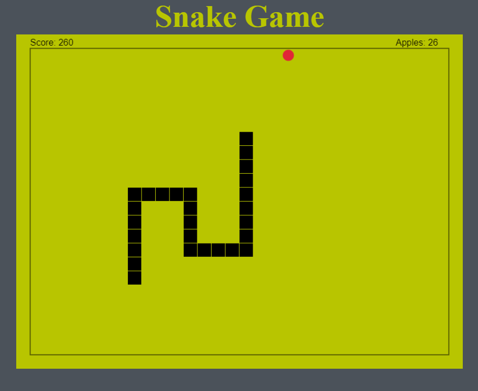

# Retro Snake Game
Retro Snake Game written entirely in Vanilla JavaScript, HTML and CSS

Run Code [Here](https://hcuellar-coder.github.io/SnakeGame/)

## Summary
Old School Snake Game with the look and feel of the Retro Nokia Brick phones we grew up playing with. The game is simple in its rules,
move the snake using the arrow keys on the keyboard and eat some apples. The more apples that are eaten the longer the snake gets.
The snake is allergic to the edges and sadly to itself, so stay away or it's GAME OVER! The game taught me the logic behind game design,
it was definetly a fun experience!

## Author
Heriberto Cuellar – Full Stack Software Developer - [LinkedIn](https://www.linkedin.com/in/heriberto-c-5aa11952)
